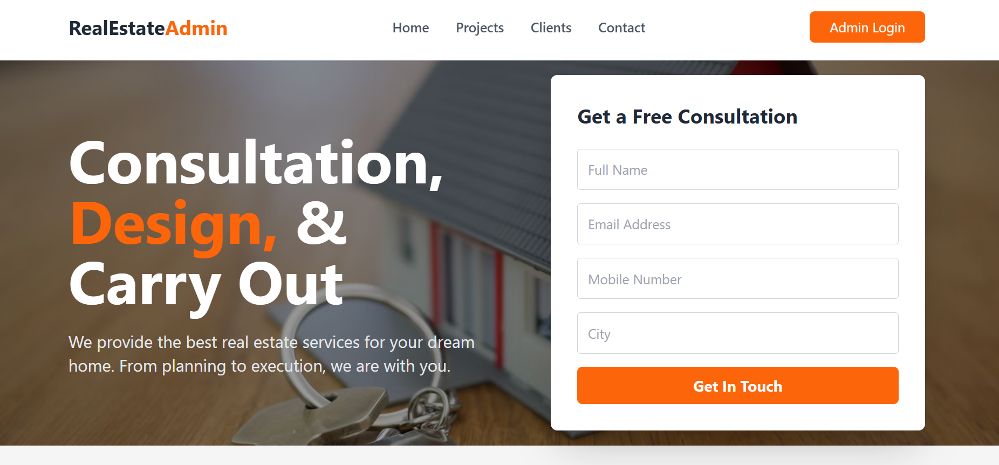
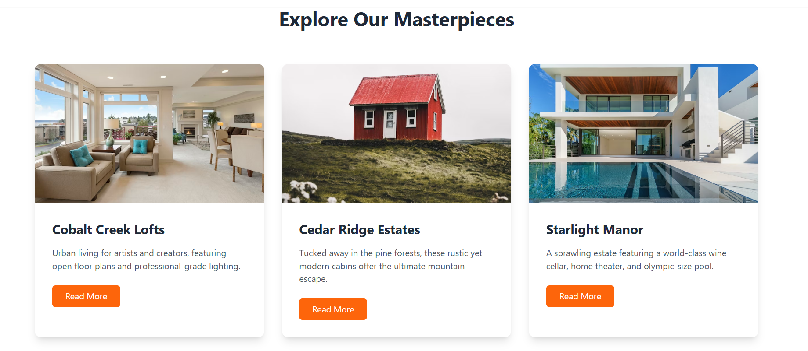
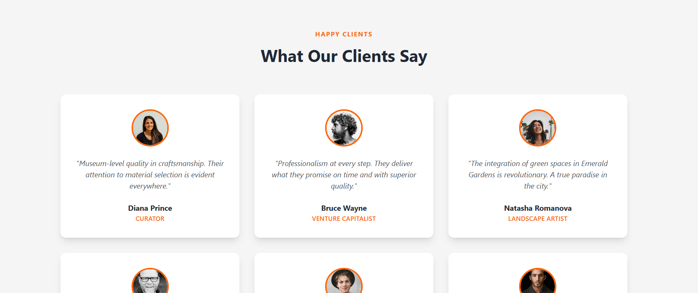
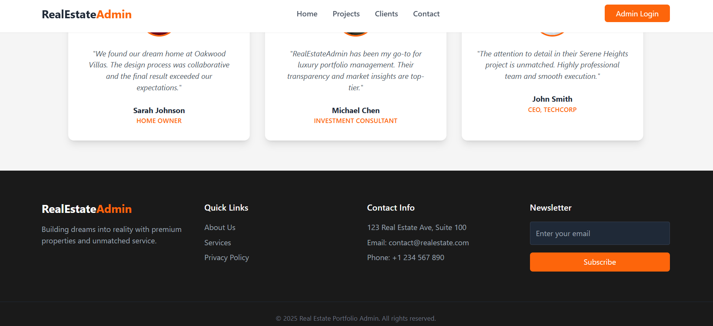
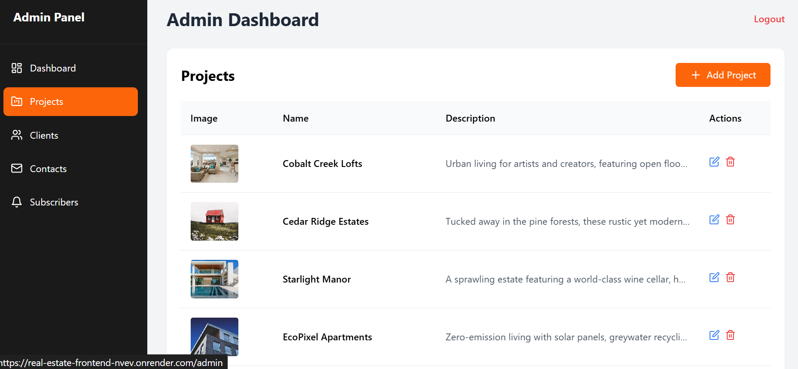
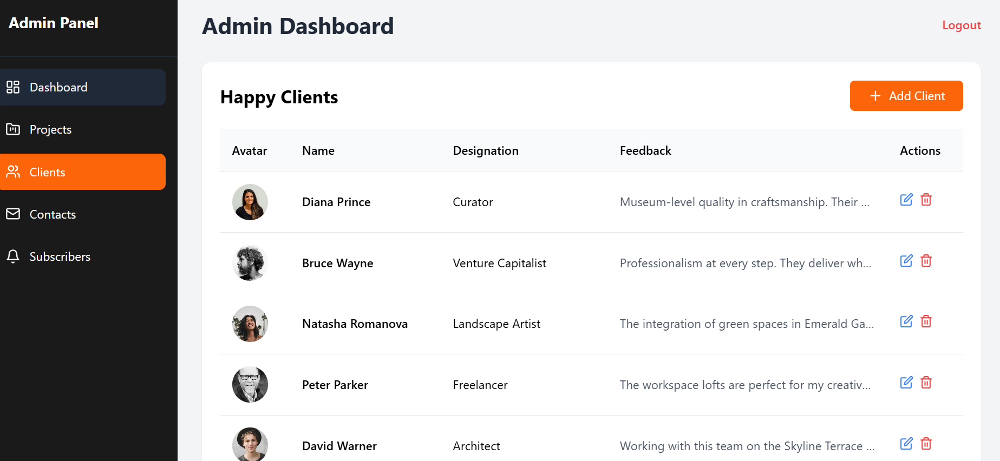
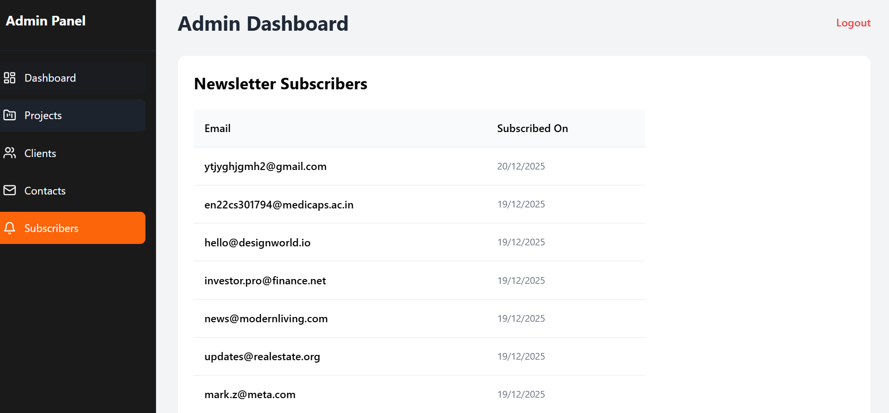
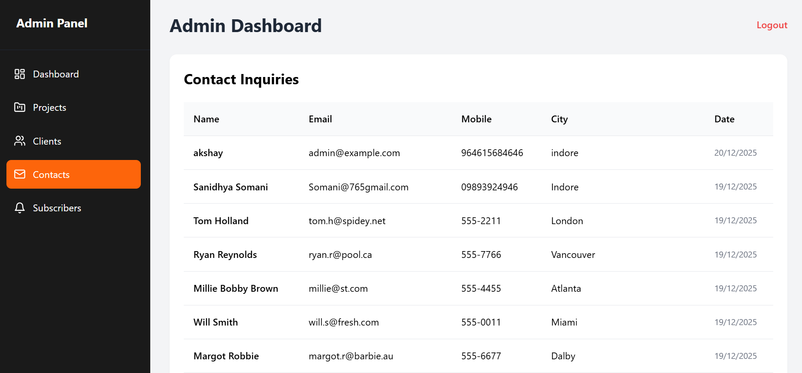
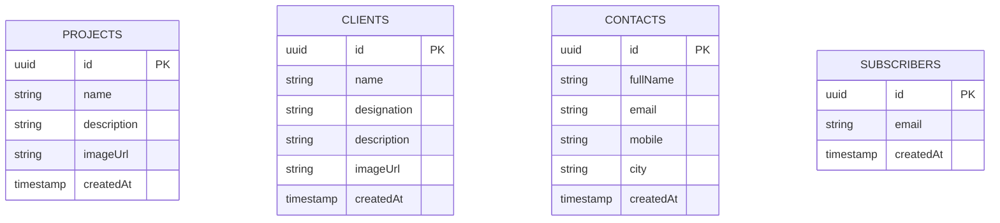

# Real Estate Portfolio Admin

### 🌐 Live Links
- **Frontend**: [https://real-estate-frontend-nvev.onrender.com](https://real-estate-frontend-nvev.onrender.com)
- **Backend**: [https://real-estate-portfolio-admin.onrender.com](https://real-estate-portfolio-admin.onrender.com)

---

## 📖 Project Overview

A professional full-stack web application designed for real estate agencies to showcase properties, manage client testimonials, and track leads effectively.

Admin credentials 
email - admin@example.com
password - admin123

### 🎨 Frontend (React + Tailwind CSS)
- **Tech Stack**: React 18, Vite, Tailwind CSS, Lucide Icons, React Router, Axios.
- **Features**:
  - Responsive Landing Page with smooth scrolling.
  - Interactive "Our Projects" and "Happy Clients" sections.
  - Fully featured Admin Dashboard with secure login.
  - CRUD operations for projects and clients.
  - Lead management tables for contacts and newsletter subscribers.

### ⚙️ Backend (Node.js + Express + Sequelize)
- **Tech Stack**: Node.js, Express, PostgreSQL (Neon), Sequelize ORM, JWT, Multer, Sharp.
- **Features**:
  - Secure REST API with JWT authentication.
  - Image processing and automatic cropping (450x350) for uniform display.
  - Error handling and robust validation using Zod.
  - Optimized for production with CORS and Security Best Practices.

---

## 📸 Portfolio Snapshots

### Public Landing Page
| Home Section | Our Projects |
| :---: | :---: |
|  |  |

| Happy Clients | Footer Section |
| :---: | :---: |
|  |  |

### Admin Dashboard
| Admin Projects | Admin Clients |
| :---: | :---: |
|  |  |

| Admin Subscribers | Admin Contact Inquiries |
| :---: | :---: |
|  |  |

---

## 🗄️ Database Schema

The application uses a PostgreSQL database with the following structure:

---

## 🚀 Manual Deployment Guide (Render)

### 1. Backend (Web Service)
1. **GitHub Repository**: Connect your repo.
2. **Root Directory**: `backend`
3. **Build Command**: `npm install`
4. **Start Command**: `npm start`
5. **Environment Variables**:
   - `DB_URI`: (Your Neon Connection String)
   - `PORT`: `10000`
   - `JWT_SECRET`: (Random string)
   - `ADMIN_EMAIL`: `admin@example.com`
   - `ADMIN_PASSWORD`: `admin123`
   - `CORS_ORIGIN`: `https://real-estate-frontend-nvev.onrender.com`

### 2. Frontend (Static Site)
1. **GitHub Repository**: Connect your repo.
2. **Root Directory**: `frontend`
3. **Build Command**: `npm install && npm run build`
4. **Publish Directory**: `dist`
5. **Environment Variables**:
   - `VITE_API_BASE_URL`: `https://real-estate-portfolio-admin.onrender.com`
6. **Redirects**: Add a Rewrite rule: `/*` -> `/index.html` (Action: Rewrite).

---

## 🛠️ Local Setup
1. Clone the repository.
2. **Backend**: `cd backend && npm install && npm run dev`
3. **Frontend**: `cd frontend && npm install && npm run dev`

---
© 2025 Real Estate Portfolio Admin. All rights reserved.
